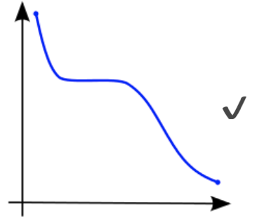

<div id="top"></div>

[![Contributors][contributors-shield]][contributors-url]
[![Forks][forks-shield]][forks-url]
[![Stargazers][stars-shield]][stars-url]
[![Issues][issues-shield]][issues-url]
![Languages][languages-shield]

<br />

<div align="center">
  <a href="https://github.com/josecarlosmemo/summer-icpc-2022">
    
  </a>
<h3 align="center">ICPC México Summer Camp 2022</h3>
  <p align="center">
        Notes and Exercises made during the International Collegiate
        Programming Contest (ICPC) México Summer Camp 2022
    <br />
                <a href="https://github.com/josecarlosmemo/summer-icpc-2022"><strong>Explore the docs »</strong></a>
            <br />
    <br />
                <a href="https://github.com/josecarlosmemo/summer-icpc-2022/issues">Report Bug</a>
    ·
    <a href="https://github.com/josecarlosmemo/summer-icpc-2022/issues">Request Feature</a>
          </p>
</div>
<details>
  <summary>Table of Contents</summary>
  <ol>
  	<li>
  	<a href="#binary-search">Binary Search</a>
  	<ul>
  	<li><a href="#implementation-of-binary-search">Implementation of Binary Search</a></li>
  	</ul>
  	</li>
  	<li>
  	<a href="#binary-lifting">Binary Lifting</a>
  	<ul>
  	<li><a href="#implementation-of-binary-lifting">Implementation of Binary Lifting</a></li>
  	</ul>
  	</li>
  	<li><a href="#binary-search-over-a-functions">Binary Search over a Functions</a></li>
  	<li>
  	<a href="#ternary-search">Ternary Search</a>
  	<ul>
  	<li><a href="#implementation-of-ternary-search">Implementation of Ternary Search</a></li>
  	</ul>
  	</li>
  	<li>
  	<a href="#good-practices-in-competitive-programming">Good Practices in Competitive Programming</a>
  	<ul>
  	<li><a href="#optimizing-cin-cout">Optimizing cin & cout</a></li>
  	<li><a href="#the-use-of-templates">The use of Templates</a></li>
  	</ul>
  	</li>
  	<li>
  	<a href="#floats-are-not-accurate">float’s are not accurate</a>
  	<ul>
  	<li><a href="#comparing-floating-point-numbers">Comparing floating-point numbers</a></li>
  	</ul>
  	</li>
  	<li>
  	<a href="#casting-data-types">Casting Data Types</a>
  	<ul>
  	<li><a href="#long-long">long long</a></li>
  	<li><a href="#float-or-double">float or double</a></li>
  	</ul>
  	</li>
  	<li>
  	<a href="#stl">STL</a>
  	<ul>
  	<li><a href="#queue-stack">Queue & Stack</a></li>
  	<li><a href="#set">Set</a></li>
  	<li><a href="#map">Map</a></li>
  	<li><a href="#operations-on-vectors">Operations on vector’s</a></li>
  	</ul>
  	</li>
  	<li>
  	<a href="#graphs">Graphs</a>
  	<ul>
  	<li><a href="#important-graph-theory-concepts">Important Graph Theory Concepts</a></li>
  	<li><a href="#adjacency-matrix">Adjacency Matrix</a></li>
  	<li><a href="#adjacency-list">Adjacency List</a></li>
  	<li><a href="#dfs">DFS</a></li>
  	<li><a href="#bfs">BFS</a></li>
  	<li><a href="#dijkstras-algorithm">Dijkstra’s Algorithm</a></li>
  	</ul>
  	</li>
  	<li>
  	<a href="#number-theory">Number Theory</a>
  	<ul>
  	<li><a href="#divisibility">Divisibility</a></li>
  	<li><a href="#prime-numbers">Prime Numbers</a></li>
  	<li><a href="#sieve-of-eratosthenes">Sieve of Eratosthenes</a></li>
  	<li><a href="#fundamental-theorem-of-arithmetic">Fundamental Theorem of Arithmetic</a></li>
  	<li><a href="#number-of-divisors">Number of Divisors</a></li>
  	<li><a href="#especialized-sieves">Especialized Sieve’s</a></li>
  	<li><a href="#greatest-common-divisor">Greatest Common Divisor</a></li>
  	<li><a href="#least-common-multiplier">Least Common Multiplier</a></li>
  	</ul>
  	</li>
  	<li>
  	<a href="#trie">Trie</a>
  	<ul>
  	<li><a href="#implementation-of-nodes">Implementation of Nodes</a></li>
  	<li><a href="#adding-elements">Adding Elements</a></li>
  	<li><a href="#removing-elements">Removing Elements</a></li>
  	<li><a href="#dfs-traversal-in-a-trie">DFS Traversal in a Trie</a></li>
  	</ul>
  	</li>

  </ol>
</details>

## Binary Search

**Time Complexity:** $O\log \left(n\right)$

This type of search is used to find an element in a sorted array. It is
a binary search, because it is divided in two parts: the first part is
the array from the beginning to the middle, and the second part is the
array from the middle to the end.

### Implementation of Binary Search

``` cpp
typedef long long lli;
lli find(vector<lli>&v, lli x){
    lli l = 0, r = v.size() - 1;
    while(r-l > 1){
        lli mid = (l+r)/2;
        if(v[mid] == x) return mid;
        else if(v[mid] < x) l = mid;
        else r = mid;
    }
    if(v[l] == x) return l;
    if(v[r] == x) return r;
    return -1;
}
```

<p align="right">(<a href="#top">back to top</a>)</p>

## Binary Lifting

**Time Complexity:** $O\log \left(n\right)$

### Implementation of Binary Lifting

``` cpp
typedef long long lli;
lli find(vector<lli>&v, lli x){
    lli c = 0;
    for(lli p = v.size(); p; p/=2)
        while(c+p < v.size() && v[c+p] < x) c += p;
    if(v[c] == x) return c;
    return -1;
}
```

This type of search is better suited for finding integers in a sorted
array.

<p align="right">(<a href="#top">back to top</a>)</p>

## Binary Search over a Functions

A vector can be seen as a function. Binary searches work over any
monotonic function. In other words, the vector we use must be ordered.

|                          |                          |                     |
|--------------------------|--------------------------|---------------------|
|  |  |  |

<p align="right">(<a href="#top">back to top</a>)</p>

## Ternary Search

It is a type of search that is used to find the maximum or minimum of a
unimodal function. It is a ternary search, because it is divided in
three parts.

### Implementation of Ternary Search

``` cpp
typedef long long lli;
lli find(vector<lli> &v){
    lli l = 0, r = v.size() -1;
    while(r-l>2){
        lli m1 = l + (r-l)/3;
        lli m2 = r - (r-l)/3;
        if(v[m1]<v[m2]) r = m2;
        else l = m1;
    }
    lli ans = NULL;
    for(lli i = l; i <= r; i++)
        ans = min(ans, v[i]);
    return ans;
}
```


<p align="right">(<a href="#top">back to top</a>)</p>

## Good Practices in Competitive Programming

### Optimizing `cin` & `cout`

Adding these lines to your code will make it faster:

``` cpp
ios_base::sync_with_stdio(false);
cin.tie(0);
cout.tie(0);
```

**Warning:** When using the lines above, you must also use the `'\n'`
directive instead of `endl`.

### The use of Templates

The use of templates in competitive programming is very important,
because it allows you to use the same code for different types of
problems. As well as, optimizing the amount of code you need to write.

An example template is located in the `template.cpp` file.

#### Example Code using the `template.cpp` file

We have an array of *n* numbers. We want to know the sum of all positive
numbers in the array.

$$
1 \leq n \leq 10^6
$$

$$
-10^{10} \leq a_i \leq 10^{10}
$$

``` cpp
int main(){ _
    lli n, x, tot=0; cin >> n;
    fore(i, 0, n) cin >> x, tot += max(0LL, x);
    cout << tot << ENDL;
    return 0;
}
```

<p align="right">(<a href="#top">back to top</a>)</p>

## `float`’s are not accurate

When using `float`’s, you must use the `fixed` directive to make sure
that the output is not rounded. You can use the `setprecision` directive
to set the number of decimal places.

``` cpp
cout << setprecision(10) << fixed << floatValue << ‘\n’;
```

### Comparing floating-point numbers

Because `float`’s are not accurate, you can use the following functions
in order to compare them:

``` cpp
typedef long double ld;
bool geq(ld a, ld b){return a-b >= eps;} // a >= b
bool leq(ld a, ld b){return b-a >= eps;} // a <= b
bool ge(ld a, ld b){return a-b > eps;} // a > b
bool le(ld a, ld b){return b-a > eps;} // a < b
bool eq(ld a, ld b){return abs(a-b) <= eps;} // a == b
bool neq(ld a, ld b){return abs(a-b) > eps;} // a != b
```

`eps` or `epsilon` is a small number that is used to compare
floating-point numbers. Most of the time, it is $10^{-9}$.

<p align="right">(<a href="#top">back to top</a>)</p>

## Casting Data Types

Whenever you’re writing constants, you should specify the type of the
constant.

### `long long`

For example, if you want to write a constant that is a `long long`, you
can use the following:

``` cpp
1000000LL;
```

### `float` or `double`

When you need to write a floating-point number, you can use the
following:

``` cpp
double a = 1.0 / 3.0;
```

<p align="right">(<a href="#top">back to top</a>)</p>

## STL

### Queue & Stack

They allow us to store elements in a FIFO (First In First Out) or LIFO
(Last In First Out) manner. They are implemented using the `std::queue`
and `std::stack` classes. They support insertion, removal and
consultation of elements on top or front.

``` cpp
queue<int> myQueue;
stack<int> myStack;

myQueue.push(2);
cout << myQueue.front() << endl;
myQueue.pop();

myStack.push(2);
cout << myStack.top() << endl;
myStack.pop();
```

### Set

-   Data storage of unique sorted elements in $O\log \left(n\right)$
    time.
-   Insertion, deletion and lookup of elements in $O\log \left(n\right)$
    time.
-   You can get the size of the set in $O\left(1\right)$ time.

``` cpp
set<int> mySet;
mySet.insert(2);
mySet.insert(2);
mySet.insert(3);
cout << mySet.size() << endl;
cout << mySet.count(2) << endl;
```

### Map

A map is a data structure that stores elements in a key-value pair.

-   Allows you to insert, remove and lookup elements in
    $O\log\left(n\right)$ time.

``` cpp
map<string,int> myMap;
myMap["a"] = 1;
cout << myMap["a"] << endl;
cout << myMap.size() << endl;
cout << myMap.count("b") << endl;
```

### Operations on `vector`’s

``` cpp
sort(myVector.begin(), myVector.end());
int x = 5;
int posLowerX = lower_bound(myVector.begin(), myVector.end(), x) - myVector.begin();
int posUpperX = upper_bound(myVector.begin(), myVector.end(), x) - myVector.begin();
bool exist = binary_search(myVector.begin(), myVector.end(), x);
```

<p align="right">(<a href="#top">back to top</a>)</p>

## Graphs

### Important Graph Theory Concepts

-   **Cycle:** A cycle is a path that starts and ends at the same node.
-   **Connected:** A graph is connected if there is a path between any
    two nodes.
-   **Tree:** A tree is a connected graph with no cycles.

### Adjacency Matrix

-   It is represented by a 2D array with the of
    $N_{nodes} \times N_{nodes}$
-   In the position $(i,j)$ of the array, we store the weight of the
    edge $(i,j)$
-   It consumes $O(N^2)$ space, which is a lot.
-   It is faster when consulting a specific connection.

``` cpp
int main(){_
lli nodes, edges, a, b; cin >> nodes >> edges;
vector<vector<bool>> adjMatrix(nodes, vector<bool>(nodes, false));
fore(i, 0, edges){
    cin >> a >> b;
    adjMatrix[a][b] = adjMatrix[b][a] = true;
}
return 0;
}
```

### Adjacency List

-   It uses a matrix where each row $x$ of the matrix contains the list
    of the nodes that are connected to $x$.
-   It uses dynamic memory allocation, to only store the connections
    that are necessary.
-   It is slower to consult a specific connection, but faster to consult
    the entire graph.
-   Consumes $O(N+E)$ space, where $N$ is the number of nodes and $E$ is
    the number of edges.

``` cpp
int main(){_
lli nodes, edges, a, b; cin >> nodes >> edges;
vector<vector<int>> adjList(nodes);
fore(i, 0, edges){
    cin >> a >> b;
    adjList[a].push_back(b);
    adjList[b].push_back(a);

}
```

### DFS

DFS is a recursive depth-first search algorithm. It is used to traverse
a graph.

``` cpp
void dfs(int currNode){
    visited[currNode] = true;
    for(int nextNode : adjList[currNode]){
        if(!visited[nextNode]){
            dfs(nextNode);
        }
    }

}
```

### BFS

BFS is an iterative breadth-first search algorithm. It is used to
traverse a graph.

``` cpp
queue<int> bfs;
bfs.push(0);
visited[0] = true;
while(!bfs.empty()){
    int currNode = bfs.front();
    bfs.pop();
    for(int nextNode : adjList[currNode]){
        if(!visited[nextNode]){
            bfs.push(nextNode);
            visited[nextNode] = true;
        }
    }
}
```

### Dijkstra’s Algorithm

Single-source shortest path algorithm. Dijkstra’s algorithm finds the
shortest path from a source node to all other nodes in a graph.

It is based on having all edges that are connected to node $A$, then
recursively doing the following:

-   Of all the nodes that haven’t been visited, find the one with the
    lowest distance that we can reach.
-   Calculate new distances with the new node.

``` cpp
vector<int> dijkstra(int source, int nodes){
    vector<int> dist(nodes, -1);
    dist[source] = 0;
    priority_queue<pair<int, int>, vector<pair<int, int>>, greater<pair<int, int>>> pq;
    pq.push({0, source});
    while(!pq.empty()){
        pair<int,int> currNode = pq.top();
        pq.pop();
        if(dist[currNode.second] != currNode.first){
            continue;
        }
        for(auto edge: adjList[currNode.second]){
           int newDist = edge.second + currNode.first;
              if(dist[edge.first] == -1 || dist[edge.first] > newDist){
                dist[edge.first] = newDist;
                pq.push({newDist, edge.first});
              }
        }

    }
    return dist;
}
```

<p align="right">(<a href="#top">back to top</a>)</p>

## Number Theory

### Divisibility

A number $A$ divides a number $B$ if there exists an integer $K$ such
that:

$$
A \times K = B
$$

### Prime Numbers

A number is prime if it is divisible by only 1 and itself.

| Number | isPrime |
|--------|---------|
| 1      | `false` |
| 2      | `true`  |
| 3      | `true`  |

### Sieve of Eratosthenes

The sieve of Eratosthenes is a simple algorithm for finding all prime
numbers up to a given number. It works by iterating over all numbers
from 2 to the given number, and marking each number that is divisible by
a number that has already been marked as non-prime.

``` cpp
long long n;
vector<bool> sieve(n, true);
vector<long long> makeSieve(){
    sieve[0] = sieve[1] = false;
    for(long long i = 2; i * i < n; ++i){
        if(!sieve[i]) continue;
        for(long long j = i * i; j < n; j += i){
            sieve[j] = false;
        }S
    }
    vector<long long> primes;
    for(long long i = 2; i < n; ++i){
        if(sieve[i]){
            primes.push_back(i);
        }
    }
    return primes;
}
```

### Fundamental Theorem of Arithmetic

All numbers have a unique representation as a multiplication of prime
numbers.

$$
n = p_1^{a_1} p_2^{a_2} \cdots p_r^{a_r}
$$

``` cpp
vi decomposition(int x){
    vi prime_representation;
    for(auto p: primes){
        while(x % p == 0){
            prime_representation.push_back(p);
            x /= p;
        }
    }
    if(x > 1){
        prime_representation.push_back(x);
    }
    return prime_representation;
}
```

### Number of Divisors

When a number is written as a product of prime numbers, the total number
of divisors is:

$$
\left(a_1 + 1\right)\times\left(a_2 + 1\right)\times\left(a_3 + 1\right)\times\ldots\times\left(a_r + 1\right)
$$

### Especialized Sieve’s

#### Greatest Divisor Sieve

``` cpp
void makeSieve(int n){
    vi sieve(n);
    fore(i,0,n) sieve[i] = i;
    for(int i = 2; i * i < n; ++i){
        if(sieve[i] != i){
            continue;
        }
        for(int j = i * 2; j < n; j += i){
            sieve[j] = i;
        }

    }
}
```

#### Number of Divisors Sieve

``` cpp
void makeSieve(int n){
    vi sieve(n, 2);
    sieve[0] = 0;
    sieve[1] = 1;
    for (int i = 2; i < n; ++i){
        for(int j = i * 2; j < n; j+=i){
            ++sieve[j];
        }
    }
}
```

#### Sum of Divisors Sieve

``` cpp
void makeSieve(int n){
    vi sieve(n, 1);
    sieve[0] = 0;
    for (int i = 2; i < n; ++i){
        for (int j = i; j < n; j += i){
            sige[j] += i;
        }
    }
}
```

### Greatest Common Divisor

The greatest common divisor between two numbers is the largest number
that divides both of them.

``` cpp
int gcd(int a, int b){
    if (b == 0) return a;
    return gcd(b, a % b);
}
```

### Least Common Multiplier

The least common multiplier between two numbers is the smallest number
that can be divided by both of them.

$$
LCM(a, b) = \frac{a \cdot b}{gcd(a, b)}
$$

<p align="right">(<a href="#top">back to top</a>)</p>

## Trie

It is a data structure that is used to store a set of strings, based on
their prefixes.

Given the list of strings:

-   camp
-   icpc
-   casa
-   caso

We can build their trie:


A trie has the property of having the strings sorted implicitly when
building itself.

### Implementation of Nodes

``` cpp
struct Node{
    map<char, long long> next;
    bool end = false;
}
vector<Node> trie;
long long currNode = 0;
long long newNode(){
    trie.push_back(Node());
    return currNode++;
}
```

### Adding Elements

``` cpp
void add(string& s){
    long long pt = 0;
    for(long long i = 0; i < s.size(); i++){
        if(!trie[pt].next.count(s[i])){
            trie[pt].next[s[i]] = newNode();
        }
        pt = trie[pt].next[s[i]];

    }
    trie[pt].end = true;
}
```

### Removing Elements

``` cpp
void remove(string& s){
    long long pt = 0;
    for(long long i = 0; i < s.size(); i++){
        pt = trie[pt].next[s[i]];
    }
    trie[pt].end = false;
}
```

### DFS Traversal in a Trie

``` cpp
void dfs(long long pt, string s =""){
    if(trie[pt].end){
        cout << s << endl;
    }
    for(auto i: trie[pt].next){
        s.push_back(i.first);
        dfs(i.second, s);
        s.pop_back();
    }
}
```

### Built With

<div>

</div>

<p align="right">(<a href="#top">back to top</a>)</p>

## Contributing

Contributions are what make the open source community such an amazing place to learn, inspire, and create. Any contributions you make are **greatly appreciated**.

If you have a suggestion that would make this better, please fork the repo and create a pull request. You can also simply open an issue with the tag "enhancement".
Don't forget to give the project a star! Thanks again!

1. Fork the Project
2. Create your Feature Branch (`git checkout -b feature/AmazingFeature`)
3. Commit your Changes (`git commit -m 'Add some AmazingFeature'`)
4. Push to the Branch (`git push origin feature/AmazingFeature`)
5. Open a Pull Request

<p align="right">(<a href="#top">back to top</a>)</p>

[contributors-shield]: https://img.shields.io/github/contributors/josecarlosmemo/summer-icpc-2022.svg?style=for-the-badge
[contributors-url]: https://github.com/josecarlosmemo/summer-icpc-2022/graphs/contributors
[forks-shield]: https://img.shields.io/github/forks/josecarlosmemo/summer-icpc-2022.svg?style=for-the-badge
[forks-url]: https://github.com/josecarlosmemo/summer-icpc-2022/network/members
[stars-shield]: https://img.shields.io/github/stars/josecarlosmemo/summer-icpc-2022.svg?style=for-the-badge
[stars-url]: https://github.com/josecarlosmemo/summer-icpc-2022/stargazers
[issues-shield]: https://img.shields.io/github/issues/josecarlosmemo/summer-icpc-2022.svg?style=for-the-badge
[issues-url]: https://github.com/josecarlosmemo/summer-icpc-2022/issues
[languages-shield]: https://img.shields.io/github/languages/count/josecarlosmemo/summer-icpc-2022.svg?style=for-the-badge
